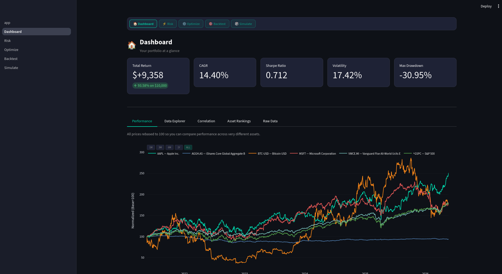
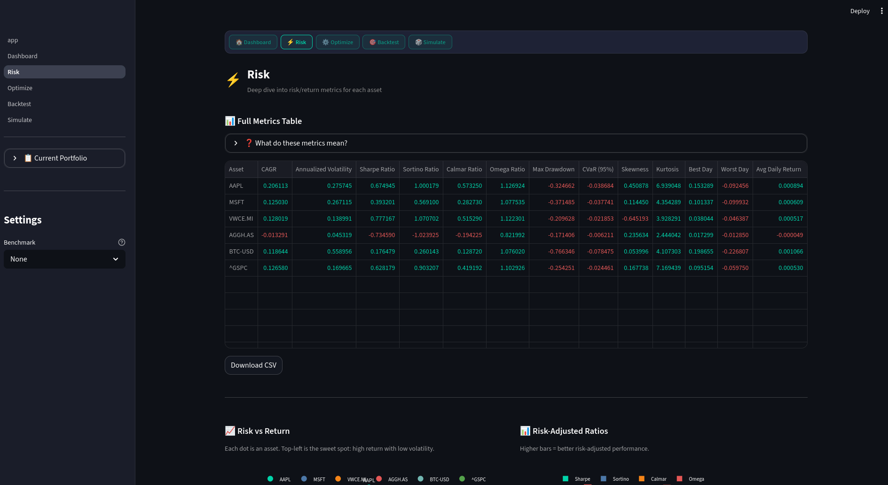
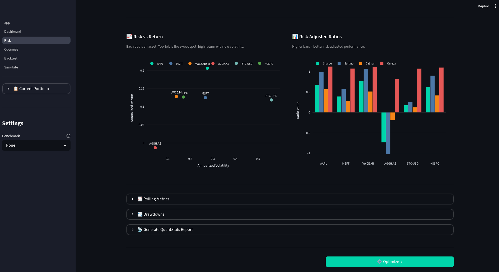
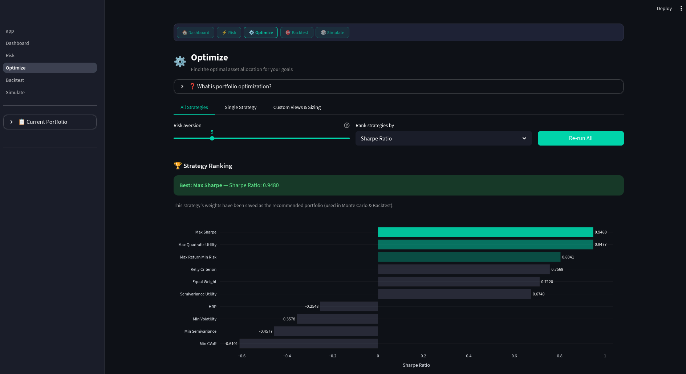
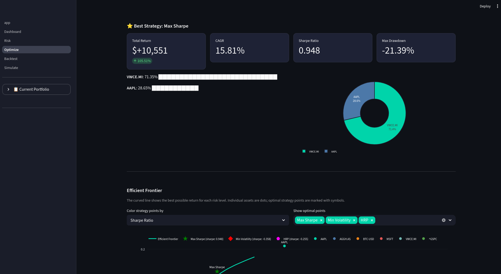
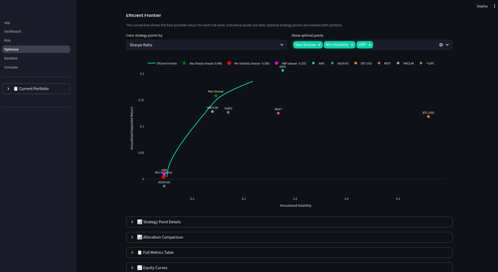
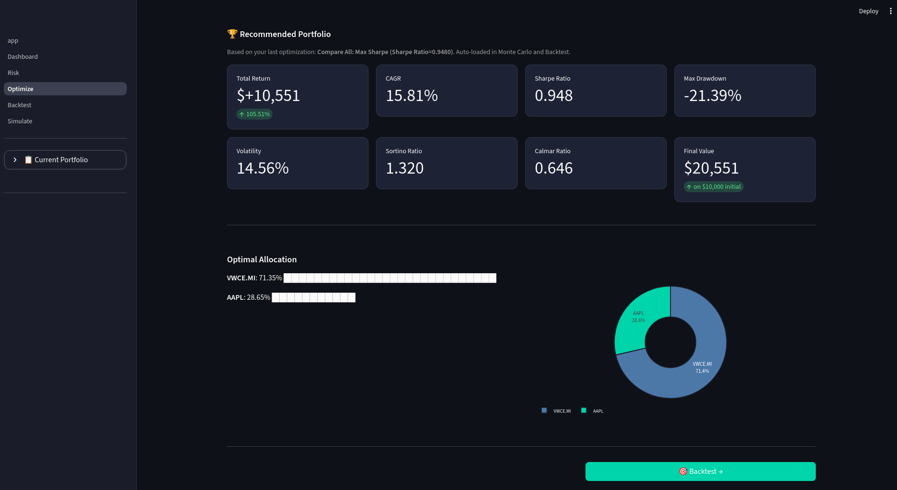
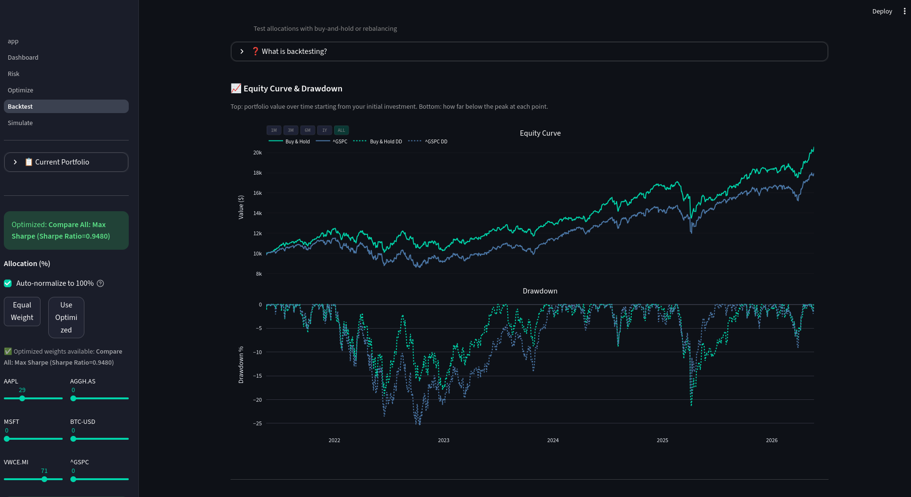

# NEAR Investing

A portfolio analysis and optimization tool for European investors. Fetch real market data, analyze risk, backtest strategies, optimize allocations, and simulate future scenarios — all from a single web UI.

[](https://opensource.org/licenses/MIT)
[](https://www.python.org/)
[](https://streamlit.io/)

## Overview

NEAR Investing is a Streamlit-based web application that lets you analyze any combination of stocks, ETFs, indices, and cryptocurrencies. Designed with European investors in mind — supports UCITS ETFs and EU-listed assets via Yahoo Finance.

The workflow follows a natural progression: **fetch data → analyze risk → optimize allocation → backtest → simulate**.

## Screenshots

<details>
<summary><strong>Home Page</strong></summary>


</details>

<details>
<summary><strong>Dashboard</strong></summary>



</details>

<details>
<summary><strong>Risk Metrics</strong></summary>





</details>

<details>
<summary><strong>Optimization</strong></summary>









</details>

<details>
<summary><strong>Backtest</strong></summary>



</details>

## Pages

### Dashboard
- **Purpose:** Portfolio overview with KPIs, performance charts, correlation, and asset rankings
- **Features:** Normalized price comparison, return distributions, correlation heatmap, asset ranking table
- **KPIs:** Total Return, CAGR, Sharpe Ratio, Volatility, Max Drawdown

### Risk Metrics
- **Purpose:** Deep dive into risk and return characteristics for each asset
- **Features:** 14+ metrics per asset, rolling metrics over configurable windows, drawdown visualization, benchmark comparison
- **Metrics:** Sharpe, Sortino, Calmar, Omega, CVaR, Max Drawdown, Skewness, Kurtosis, Alpha, Beta, Treynor, Information Ratio
- **Export:** QuantStats HTML reports for individual assets

### Optimization
- **Purpose:** Find the optimal asset allocation using mathematical optimization
- **Features:** 10 strategies, efficient frontier visualization, Black-Litterman model, Kelly Criterion, strategy ranking
- **Strategies:**
  - Mean-Variance: Max Sharpe, Min Volatility, Efficient Return/Risk, Regularized Sharpe
  - Downside Risk: Min CVaR, Min Semivariance, Semivariance Utility
  - Alternative: HRP (Hierarchical Risk Parity), Kelly Criterion, Black-Litterman

### Backtest
- **Purpose:** Simulate historical portfolio performance with your chosen allocation
- **Features:** Buy-and-hold vs periodic rebalancing, equity curve and drawdown charts, allocation comparison, yearly returns heatmap
- **Options:** Monthly, quarterly, or yearly rebalancing; conservative/balanced/aggressive presets

### Simulate
- **Purpose:** Stress-test your portfolio with Monte Carlo and walk-forward analysis
- **Monte Carlo:** Parametric and historical bootstrap simulations, configurable paths and time horizon, multi-allocation stress comparison
- **Walk-Forward:** Rolling window optimization with train/test splits, weights-over-time visualization, multi-strategy comparison

## Documentation

### [Documentation Hub](docs/README.md)
Comprehensive documentation with guides and references

### [Quick Start Guide](docs/QUICK_START.md)
Get up and running in 5 minutes

### [Guides](docs/guides/)
Detailed documentation for each page:
- [Dashboard Guide](docs/guides/dashboard-guide.md)
- [Risk Metrics Guide](docs/guides/risk-metrics-guide.md)
- [Optimization Guide](docs/guides/optimization-guide.md)
- [Backtest Guide](docs/guides/backtest-guide.md)
- [Simulation Guide](docs/guides/simulation-guide.md)

### [FAQ](docs/FAQ.md)
Frequently asked questions and troubleshooting

### [Contributing Guide](CONTRIBUTING.md)
Guide for contributing to the project

## System Requirements

- **Python**: 3.11 or later
- **OS**: Any (tested on Fedora Linux)
- **Browser**: Any modern browser (Firefox, Chrome, Safari)
- **Internet**: Required for fetching data from Yahoo Finance

## Installation

### Quick Start

```bash
git clone https://github.com/neardaniel-pls/near-investing.git
cd near-investing

python -m venv venv
source venv/bin/activate
pip install -r requirements.txt

streamlit run app.py
```

Open http://localhost:8501 in your browser.

### Jupyter Notebooks

For programmatic analysis, use the included notebooks:

```bash
source venv/bin/activate
jupyter notebook notebooks/
```

| Notebook | Purpose |
|----------|---------|
| `01_data_fetching.ipynb` | Fetch prices, compute returns, correlation |
| `02_risk_metrics.ipynb` | Full risk/return analysis per asset |
| `03_backtest.ipynb` | Portfolio backtesting |
| `04_optimization.ipynb` | Mean-variance optimization and efficient frontier |
| `05_monte_carlo.ipynb` | Monte Carlo simulations |
| `06_rolling_optimization.ipynb` | Walk-forward analysis |

## Project Structure

```
near-investing/
├── app.py                      # Streamlit entry point (home page)
├── requirements.txt            # Python dependencies
├── pages/
│   ├── 1_Dashboard.py          # Portfolio overview
│   ├── 2_Risk.py               # Risk/return analysis
│   ├── 3_Optimize.py           # Portfolio optimization
│   ├── 4_Backtest.py           # Historical simulation
│   └── 5_Simulate.py           # Monte Carlo & walk-forward
├── src/
│   ├── config.py               # Configuration persistence
│   ├── data.py                 # Yahoo Finance fetching with caching
│   ├── metrics.py              # Risk/return metric calculations
│   ├── optimization.py         # Portfolio optimization (PyPortfolioOpt)
│   ├── portfolio.py            # Portfolio construction & equity curves
│   ├── monte_carlo.py          # Monte Carlo simulation engines
│   ├── rolling.py              # Rolling/walk-forward optimization
│   ├── charts.py               # Chart theming and helpers
│   ├── styles.py               # CSS styles and KPI rendering
│   ├── ui.py                   # Shared UI components
│   └── export.py               # CSV download helpers
├── notebooks/                  # Jupyter notebooks
├── docs/                       # Documentation
│   ├── guides/                 # Per-page guides
│   ├── FAQ.md                  # Frequently asked questions
│   ├── QUICK_START.md          # Quick start guide
│   └── README.md               # Documentation hub
├── data/
│   └── cache/                  # Cached price data (parquet)
├── reports/                    # Generated HTML reports
└── .streamlit/
    └── config.toml             # Dark theme configuration
```

## Key Dependencies

| Library | Purpose |
|---------|---------|
| [Streamlit](https://streamlit.io) | Web UI framework |
| [yfinance](https://github.com/ranaroussi/yfinance) | Market data from Yahoo Finance |
| [PyPortfolioOpt](https://github.com/robertmartin8/PyPortfolioOpt) | Portfolio optimization |
| [Plotly](https://plotly.com/python/) | Interactive charts |
| [QuantStats](https://github.com/ranaroussi/quantstats) | Financial metrics and reports |
| [scikit-learn](https://scikit-learn.org) | HRP clustering |
| [pandas](https://pandas.pydata.org) / [numpy](https://numpy.org) | Data manipulation |

## Presets

| Preset | Description |
|--------|-------------|
| Balanced Mix | Stocks + ETFs + crypto diversification |
| US Tech Giants | AAPL, MSFT, GOOGL, AMZN, NVDA, META, TSLA |
| Dividend & Value | High-dividend European ETFs + value stocks |
| European ETFs | UCITS ETFs listed on EU exchanges |
| All-World ETFs | Global diversification via EU-listed ETFs |
| Crypto | BTC, ETH, SOL, ADA, AVAX |
| 60/40 Classic | Stocks / bonds split |
| Golden Butterfly | Stocks + bonds + gold + cash |

## Contributing

Contributions are welcome! Please see [CONTRIBUTING.md](CONTRIBUTING.md) for detailed guidelines.

### Quick Contribution Guide

1. Fork the repository
2. Create a feature branch: `git checkout -b feature/your-feature`
3. Make your changes
4. Submit a pull request

## License

This project is licensed under the MIT License - see the [LICENSE](LICENSE) file for details.

## Support

- [Report Bugs](https://github.com/neardaniel-pls/near-investing/issues/new?template=bug_report.md)
- [Request Features](https://github.com/neardaniel-pls/near-investing/issues/new?template=feature_request.md)

## Related Projects

- **[fedora-user-scripts](https://github.com/neardaniel-pls/fedora-user-scripts)**: Utility scripts for Fedora Linux systems
- **[fedora-system-setup](https://github.com/neardaniel-pls/fedora-system-setup)**: Post-installation guide for Fedora Linux
- **[fedora-ai-setup](https://github.com/neardaniel-pls/fedora-ai-setup)**: AI/ML tools setup guides for Fedora Linux
- **[near-whisper](https://github.com/neardaniel-pls/near-whisper)**: GUI for local Whisper audio transcription on Fedora Linux
